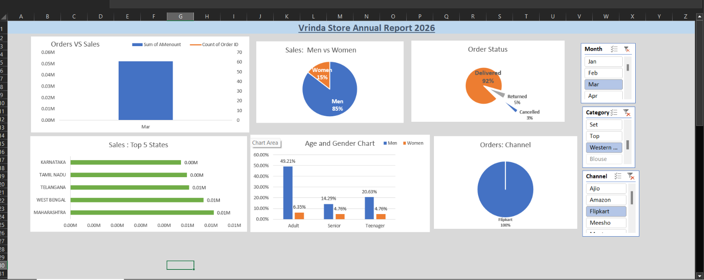
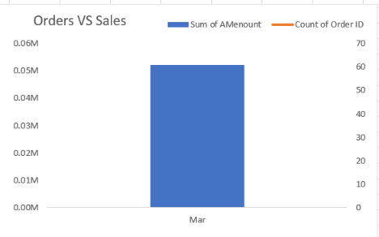
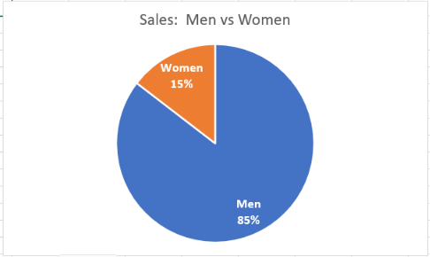
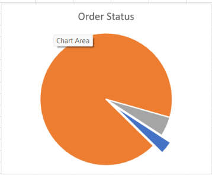
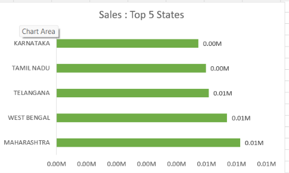

# Vrinda-Store-Excel-Analysis
Interactive Excel dashboard analyzing Vrinda Store sales data using Pivot Tables, Pivot Charts, Slicers, and business insights.

#  Vrinda Store Sales Analysis using Microsoft Excel:

An interactive Microsoft Excel dashboard project that analyzes Vrinda Store sales data using Pivot Tables, Pivot Charts, Slicers, and business intelligence techniques to generate meaningful business insights.

---

# Developed By:

**Viraj Waikar**

---
# Project Overview:

This project focuses on analyzing Vrinda Store's sales performance using Microsoft Excel.

The dashboard was built using Pivot Tables, Pivot Charts, Slicers, and Excel visualization techniques to transform raw sales data into meaningful business insights.

The dashboard allows users to interactively analyze sales trends, customer demographics, order status, sales channels, and state-wise performance, helping businesses make data-driven decisions.

---

# Business Problem:

Retail businesses generate thousands of sales records every month. Without proper analysis, it becomes difficult to understand customer behavior, monitor sales performance, identify high-performing regions, and evaluate sales channels.

This project demonstrates how Microsoft Excel can be used to convert raw transactional data into an interactive business dashboard that supports informed decision-making.

---

# Project Objective:

The main objective of this project is to build an interactive Excel dashboard capable of analyzing Vrinda Store sales data.

The dashboard helps answer important business questions related to:

- Monthly sales performance
- Order trends
- Customer demographics
- State-wise sales
- Sales channels
- Order status
- Age and gender analysis

The project demonstrates practical business analytics using Microsoft Excel.

---

# Dataset Information:

The dataset contains historical sales records of Vrinda Store.

### Dataset includes:

| Column | Description |
|----------|-------------|
| Order ID | Unique order identifier |
| Date | Order date |
| Customer | Customer information |
| Gender | Customer gender |
| Age Group | Customer age category |
| State | Customer state |
| Sales Channel | Platform used for purchase |
| Order Status | Delivered, Cancelled, Returned, etc. |
| Quantity | Number of products sold |
| Sales | Total sales amount |

---

# Dashboard Preview



---

## 📈 Monthly Sales vs Orders



This visualization compares monthly sales revenue with the number of orders placed throughout the year.

**Key Insight:** It helps identify seasonal sales trends and months with peak business performance.

---

## 👥 Sales by Gender



This chart analyzes the contribution of male and female customers to total sales.

**Key Insight:** Understanding customer demographics helps businesses design targeted marketing campaigns.

---

## 📦 Order Status Analysis



This analysis presents the distribution of customer orders based on their current status, such as Delivered, Cancelled, Returned, and Refunded.

**Key Insight:** Monitoring order status helps businesses evaluate operational efficiency, identify fulfillment issues, reduce cancellations, and improve overall customer satisfaction.

---

## 🗺️ State-wise Sales Performance



This visualization highlights sales generated across different states.

**Key Insight:** Identifying high-performing regions supports better inventory planning and regional marketing strategies.

---

## 👨‍👩‍👧 Age & Gender Analysis


This visualization analyzes purchasing behavior across different age groups while comparing male and female customers.

**Key Insight:** Understanding customer demographics enables businesses to identify their primary target audience, personalize marketing campaigns, and optimize product offerings for different customer segments.

---

## 🛒 Sales Channel Analysis


This chart compares sales across different sales channels.

**Key Insight:** It helps determine which platforms contribute the highest revenue and customer engagement.

---

# Excel Features Used

This project demonstrates practical business analytics using Microsoft Excel.

### Features Used

- Pivot Tables
- Pivot Charts
- Slicers
- Conditional Formatting
- Interactive Dashboard
- Data Cleaning
- Sorting & Filtering
- Business KPI Analysis

---

# Business Questions Solved

This dashboard helps answer several important business questions, including:

- Which month generated the highest sales?
- Which month received the highest number of orders?
- Which sales channel contributed the most revenue?
- Which states generated the highest sales?
- Which customer gender contributed more to total sales?
- Which age group purchased the most products?
- What is the distribution of order status?
- How do sales compare with order volume throughout the year?

---

# 📊 Key Business Insights

The dashboard provides several valuable business insights that can support better decision-making:

- 📈 Monthly sales and order trends help identify peak business periods and seasonal demand.
- 👥 Female customers contributed a larger share of total sales compared to male customers.
- 🛒 Different sales channels performed differently, allowing businesses to identify the most profitable platforms.
- 🗺️ State-wise analysis highlights the regions generating the highest revenue.
- 👨‍👩‍👧 Age and gender analysis helps identify the primary customer segments.
- 📦 Order status analysis provides visibility into delivered, cancelled, returned, and refunded orders.
- 📊 Comparing sales with order volume helps understand purchasing patterns throughout the year.
- 🎯 Interactive slicers allow users to filter data dynamically for deeper business analysis.

---

# 💻 Technologies Used

This project was developed using the following tools and techniques:

- Microsoft Excel
- Pivot Tables
- Pivot Charts
- Slicers
- Conditional Formatting
- Data Cleaning
- Dashboard Design
- Business Analysis
- Data Visualization

---
# 📂 Project Structure

```text
Vrinda-Store-Excel-Analysis/
│
├── README.md
├── LICENSE
├── Vrinda_Store_Data_Analysis.xlsx
│
├── dataset/
│   └── Vrinda_Store.csv
│
└── images/
    ├── 01_Dashboard.png.png
    ├── 02_Sales_vs_Orders.png.png
    ├── 03_Men_vs_Women.png.png
    ├── 04_Order_Status.png.png
    ├── 05_State_Analysis.png.png
    ├── 06_Age_Gender.png.png
    └── 07_Sales_Channel.png.png
```

# 🚀 How to Use

1. Download the repository.
2. Open **Vrinda_Store_Data_Analysis.xlsx** using Microsoft Excel.
3. Navigate to the **Vrinda Store Project 2026** dashboard sheet.
4. Use the interactive slicers to filter the dashboard based on different criteria.
5. Explore the Pivot Tables and Pivot Charts to understand the underlying analysis.
6. Review the raw dataset available within the workbook for additional exploration.

---

# 🎯 Skills Demonstrated

This project demonstrates practical business analytics and dashboard development skills using Microsoft Excel.

### Technical Skills

- Data Cleaning
- Data Analysis
- Pivot Tables
- Pivot Charts
- Interactive Dashboards
- Slicers
- Conditional Formatting
- Business Intelligence
- Dashboard Design
- Data Visualization

### Business Skills

- Sales Analysis
- Customer Segmentation
- Regional Performance Analysis
- Sales Channel Analysis
- Order Trend Analysis
- KPI Monitoring
- Business Insight Generation

---

# 📝 Conclusion

This project demonstrates how Microsoft Excel can be transformed into a powerful business intelligence tool for analyzing sales performance.

Using Pivot Tables, Pivot Charts, Slicers, and interactive dashboards, the project converts raw sales data into meaningful business insights that support data-driven decision-making.

The dashboard enables users to monitor key performance indicators, analyze customer behavior, evaluate sales channels, identify high-performing regions, and understand overall business performance through an interactive and user-friendly interface.

---

# 📬 Connect with Me

**GitHub**

https://github.com/Viraj088889999

---


